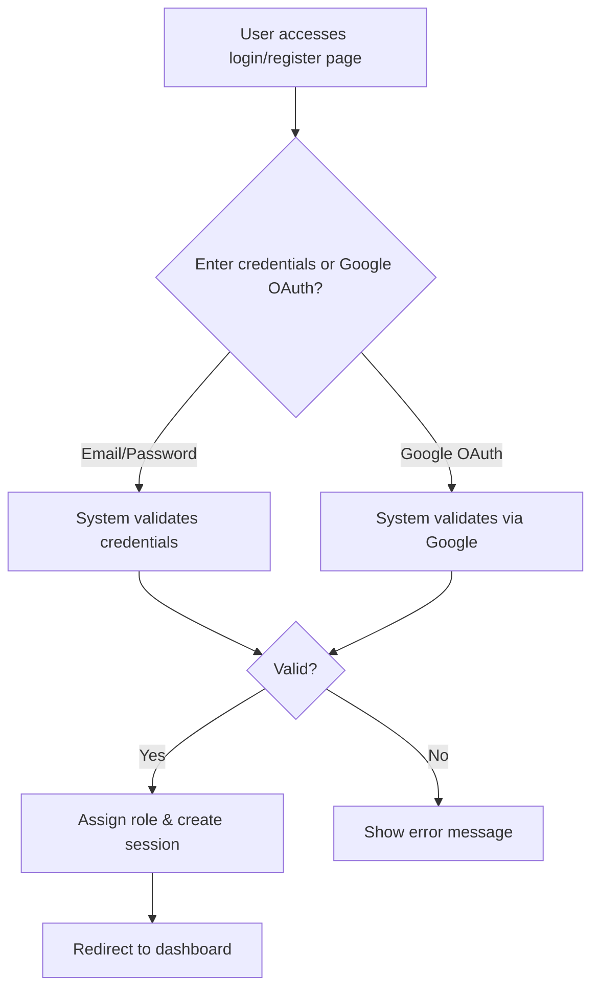
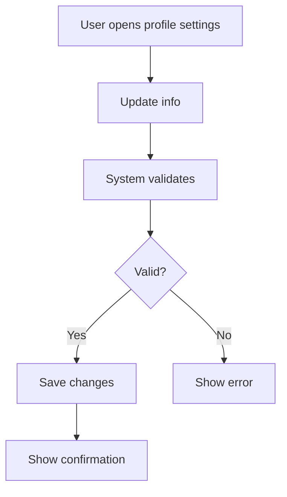
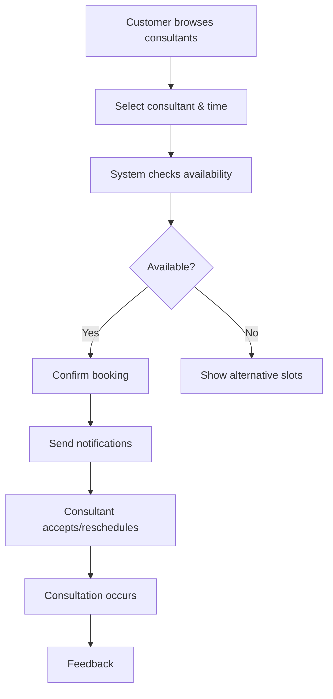
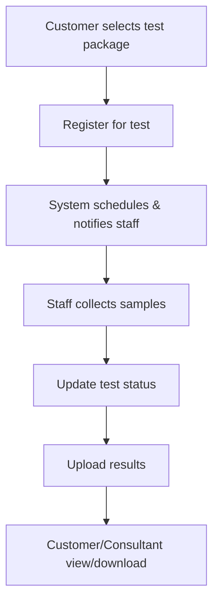
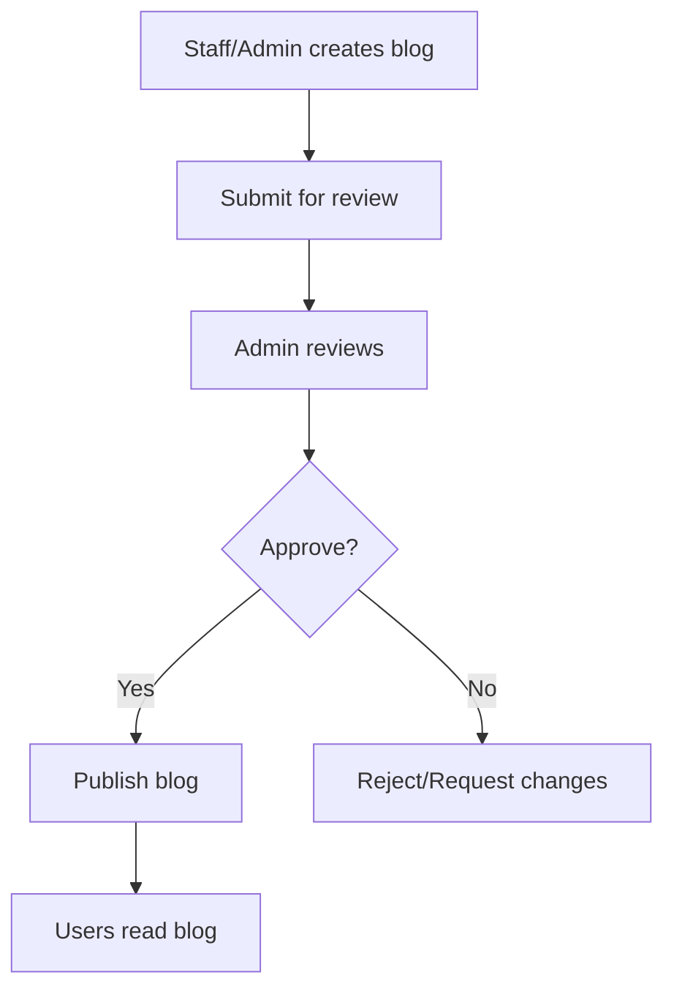
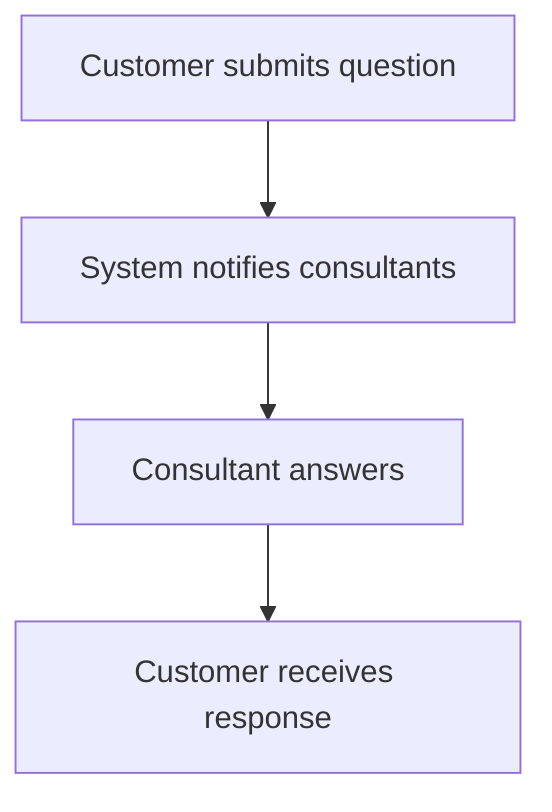
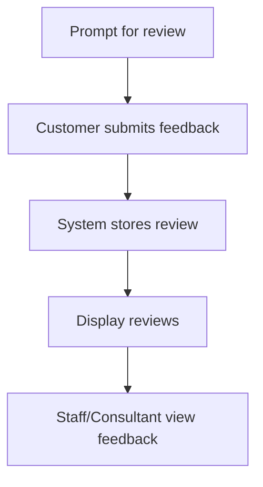
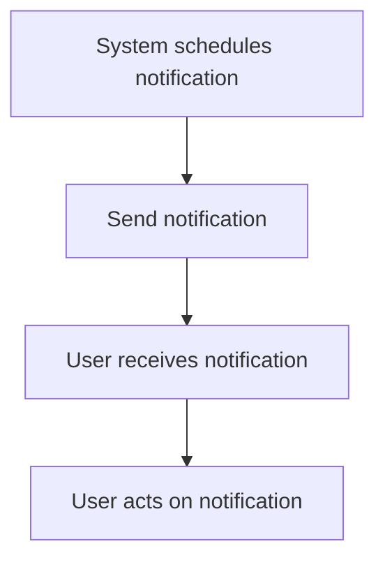
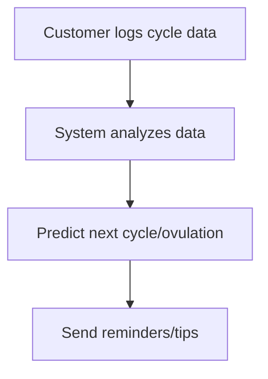
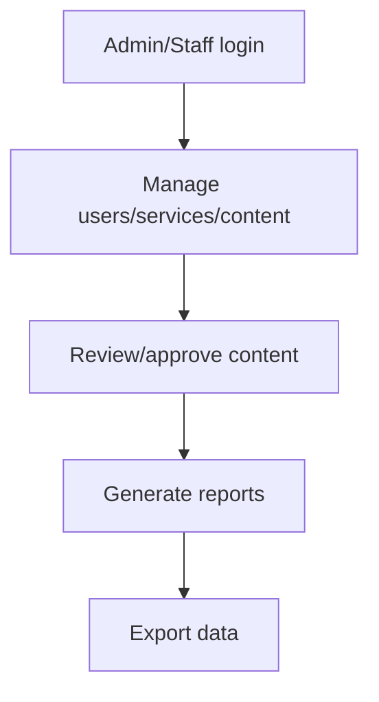

# Business Processes of Gender Healthcare Service Management System

---

## 1. User Registration & Authentication Process

**Steps:**

1. User accesses the registration or login page.
2. User enters credentials (email/password) or chooses Google OAuth.
3. System validates credentials.
4. On success, system assigns a role and creates a session (JWT).
5. User is redirected to their dashboard based on role.



---

## 2. Profile Management Process

**Steps:**

1. User navigates to profile settings.
2. User updates personal information.
3. System validates and saves changes.
4. User receives confirmation.



---

## 3. Consultation Booking & Management Process

**Steps:**

1. Customer browses consultants and selects one.
2. Customer chooses date/time and books.
3. System checks availability and confirms.
4. Notifications sent to both parties.
5. Consultant can accept/reschedule.
6. After consultation, feedback is provided.



---

## 4. Medical Test Registration & Result Management Process

**Steps:**

1. Customer selects test package/service.
2. Registers for test.
3. System schedules and notifies staff.
4. Staff collects samples and updates status.
5. Staff uploads results.
6. Customer/consultant view/download results.



---

## 5. Blog & Content Management Process

**Steps:**

1. Staff/admin creates and submits blog post.
2. Admin reviews and approves/rejects.
3. Approved posts are published.
4. Users can read blogs.



---

## 6. Q&A and Support Process

**Steps:**

1. Customer submits question.
2. System notifies consultants.
3. Consultant answers.
4. Customer receives response.



---

## 7. Payment & Invoice Processing

**Steps:**

1. Customer selects service/test and proceeds to payment.
2. Chooses payment method.
3. System processes payment and updates history.
4. Invoice generated (PDF).
5. Customer receives confirmation.

```mermaid
graph TD
  A[Customer selects service/test] --> B[Proceed to payment]
  B --> C[Choose payment method]
  C --> D[System processes payment]
  D --> E[Update payment history]
  E --> F[Generate invoice (PDF)]
  F --> G[Send confirmation]
```

---

## 8. Review & Feedback Collection Process

**Steps:**

1. Customer is prompted to leave a review.
2. Submits rating and feedback.
3. System stores and displays reviews.
4. Staff/consultants view feedback.



---

## 9. Notification & Reminder System Process

**Steps:**

1. System schedules notifications (appointments, results, reminders).
2. Sends notifications to users.
3. Users receive and act on notifications.



---

## 10. Menstrual Cycle Tracking Process

**Steps:**

1. Customer logs cycle data.
2. System analyzes and predicts next cycle/ovulation.
3. Sends reminders and tips.



---

## 11. Admin & Staff Operations Process

**Steps:**

1. Admin/Staff log in to dashboard.
2. Manage users, services, content, payments.
3. Review/approve content.
4. Generate reports and export data.


