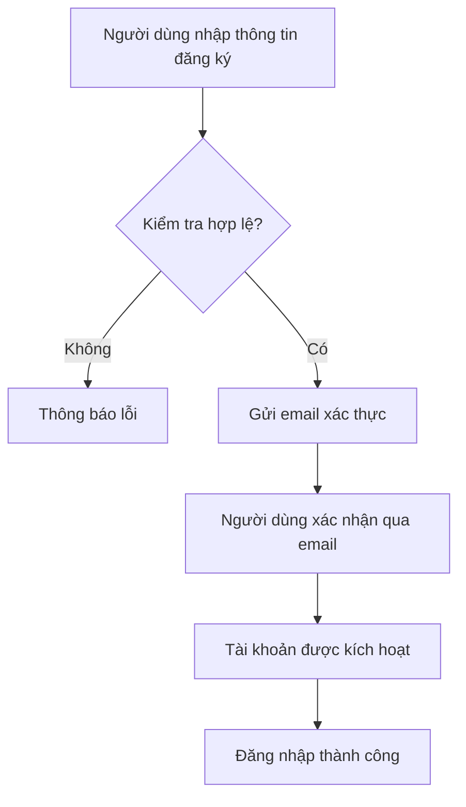
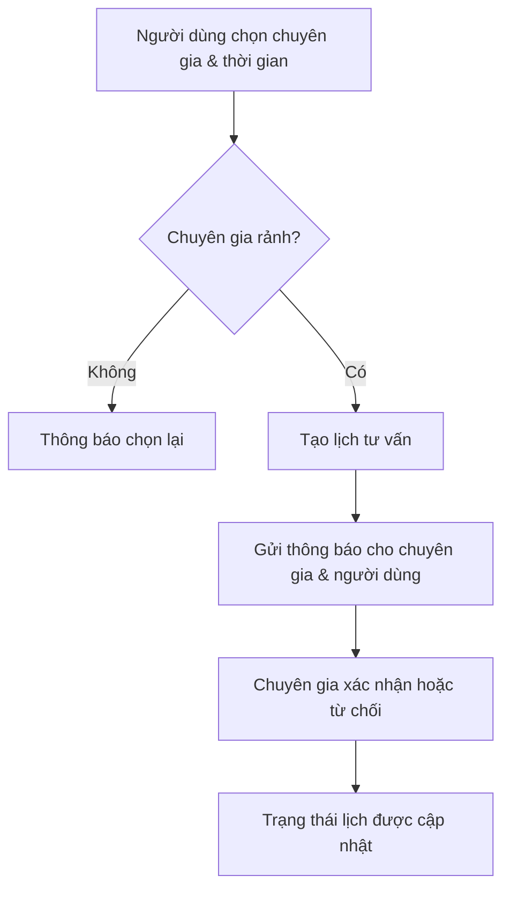
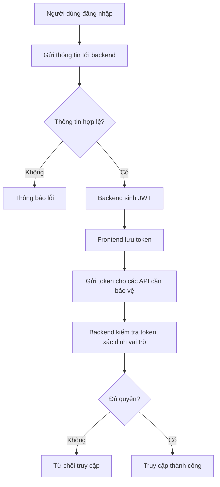
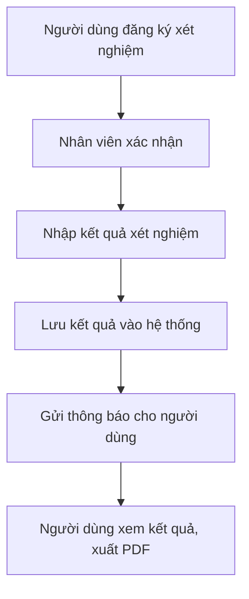
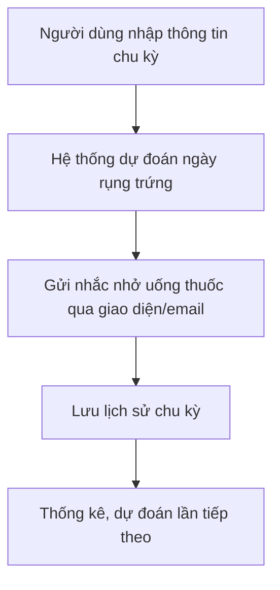
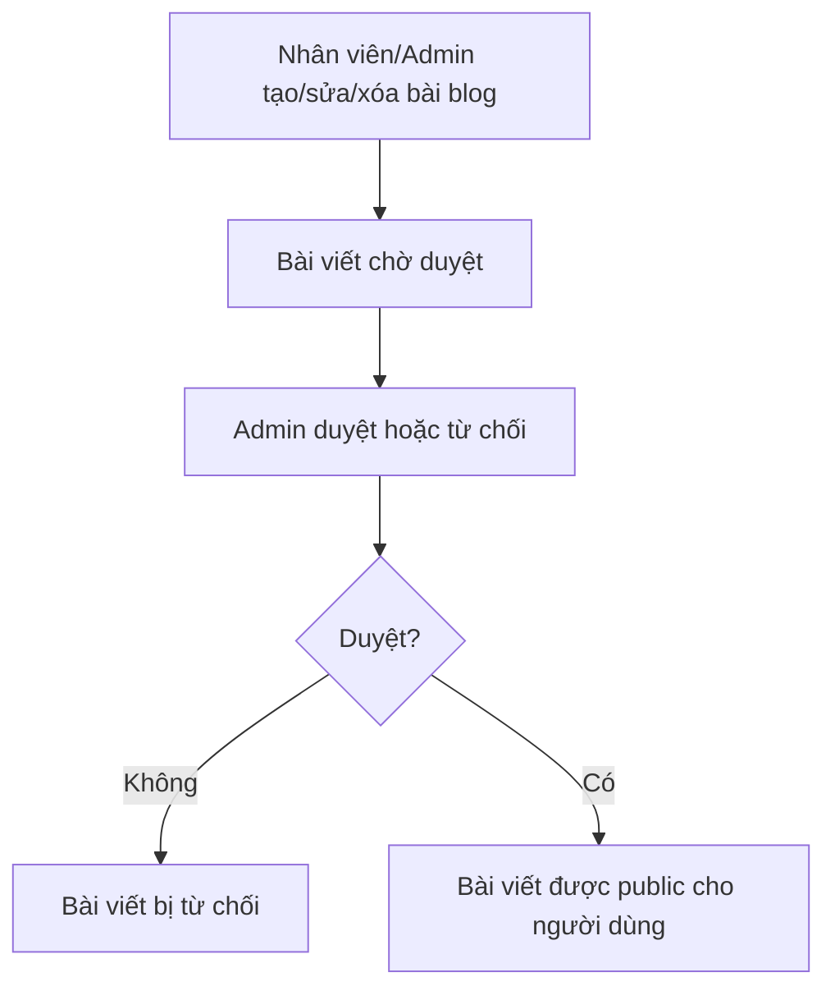

# Gender Healthcare Service Management System

## 🏥 Giới thiệu dự án

**Gender Healthcare Service Management System** là nền tảng quản lý dịch vụ chăm sóc sức khỏe chuyên biệt, hỗ trợ đa dạng nghiệp vụ như tư vấn, xét nghiệm, quản lý chu kỳ, blog sức khỏe, đánh giá, nhắc uống thuốc, v.v. Dự án hướng tới việc cung cấp giải pháp toàn diện cho khách hàng, bác sĩ, nhân viên và quản trị viên.

---

## 🛠️ Công nghệ sử dụng

### Backend (Java Spring Boot)

- **Spring Boot 3.4.5**: Framework chính xây dựng RESTful API
- **Spring Data JPA**: ORM truy xuất dữ liệu
- **Spring Security + JWT**: Xác thực, phân quyền, bảo mật API
- **MSSQL**: Cơ sở dữ liệu chính
- **Lombok**: Giảm boilerplate code
- **Stripe Java SDK**: Thanh toán trực tuyến
- **Spring Mail**: Gửi email tự động
- **Log4j2**: Logging
- **OpenAPI/Swagger**: Tài liệu hóa API
- **WebFlux**: Hỗ trợ reactive API

### Frontend (ReactJS)

- **React 19**: Xây dựng giao diện người dùng
- **Redux Toolkit, Redux Thunk, Redux Persist**: Quản lý state phức tạp
- **Material UI (MUI)**: Thư viện UI hiện đại
- **React Router v7**: Điều hướng SPA
- **Axios**: Giao tiếp API
- **Styled-components**: CSS-in-JS
- **Chart.js, Recharts**: Biểu đồ thống kê
- **JSPDF, html2canvas**: Xuất PDF
- **Dayjs, date-fns**: Xử lý ngày tháng

---

## 🏗️ Kiến trúc tổng quan

- **Backend**: Kiến trúc RESTful, chia module rõ ràng (controller, service, repository, model, dto, config, exception). Sử dụng Spring Security cho xác thực, phân quyền; JPA cho truy vấn dữ liệu; tích hợp Stripe cho thanh toán; gửi email qua Spring Mail; lưu trữ file tĩnh (ảnh, PDF) trên server.
- **Frontend**: Tổ chức theo chuẩn React: chia component, page, layout, service, redux slice/thunk, context, hooks, assets. State phức tạp dùng Redux, state đơn giản dùng Context API. Giao tiếp backend qua các service (axios). UI responsive, dễ mở rộng.

---

## 🌟 Các tính năng chính

### Backend

- **Quản lý người dùng**: Đăng ký, đăng nhập, phân quyền (Admin, Staff, Consultant, Customer), đổi mật khẩu, xác thực JWT, quên mật khẩu, xác thực email
- **Quản lý dịch vụ & gói xét nghiệm STI**: CRUD dịch vụ, gói, xét nghiệm, quản lý kết quả
- **Tư vấn & đặt lịch**: Đặt lịch tư vấn, quản lý lịch, trạng thái, phản hồi
- **Quản lý chu kỳ kinh nguyệt, nhắc uống thuốc**: Lưu lịch sử, nhắc nhở, dự đoán
- **Quản lý blog sức khỏe**: CRUD bài viết, phân loại, duyệt bài
- **Đánh giá & phản hồi**: Gửi, xem, tổng hợp đánh giá
- **Thanh toán trực tuyến**: Tích hợp Stripe, quản lý giao dịch
- **Gửi email tự động**: Thông báo, xác thực, quên mật khẩu
- **Quản lý file upload**: Ảnh đại diện, ảnh blog, PDF kết quả xét nghiệm
- **API tài liệu hóa với Swagger**

### Frontend

- **Đăng ký, đăng nhập, xác thực, phân quyền giao diện**
- **Trang chủ, giới thiệu, điều khoản, chính sách**
- **Quản lý hồ sơ, đổi thông tin, đổi mật khẩu**
- **Đặt lịch tư vấn, xem lịch sử, nhận thông báo**
- **Đăng ký xét nghiệm, xem kết quả, xuất PDF**
- **Quản lý chu kỳ, nhắc uống thuốc, dự đoán rụng trứng**
- **Xem/gửi câu hỏi, blog sức khỏe, đánh giá dịch vụ**
- **Quản trị viên: quản lý người dùng, dịch vụ, blog, báo cáo**
- **Nhân viên: duyệt xét nghiệm, quản lý phản hồi**
- **Tư vấn viên: quản lý lịch tư vấn, trả lời câu hỏi**

---

## 🔒 Bảo mật & xác thực

- **JWT Authentication**: Đăng nhập trả về JWT, frontend lưu localStorage, gửi kèm header Authorization cho API bảo vệ
- **Role-based Access Control**: Phân quyền chi tiết từng API, từng giao diện
- **Validation & Exception Handling**: Kiểm tra dữ liệu đầu vào, trả lỗi rõ ràng
- **Email Verification & Reset Password**: Gửi email xác thực, quên mật khẩu

---

## 💳 Thanh toán & upload

- **Stripe**: Thanh toán dịch vụ/gói xét nghiệm, lưu lịch sử giao dịch
- **File upload**: Ảnh đại diện, ảnh blog, PDF kết quả xét nghiệm, lưu server

---

## 🌐 API & Service

- **RESTful API**: Chuẩn REST, trả về JSON
- **Swagger UI**: Tài liệu hóa, test API trực tiếp
- **Service Layer**: Tách biệt logic nghiệp vụ, dễ bảo trì
- **Frontend Service**: Tất cả API gọi qua các service (axios), dễ mở rộng/test

---

## 🗄️ Quản lý state (Frontend)

- **Redux Toolkit**: Quản lý state phức tạp (auth, xét nghiệm, user...)
- **Redux Thunk**: Xử lý bất đồng bộ (API call)
- **Redux Persist**: Lưu state vào localStorage
- **Context API**: Quản lý theme, user context đơn giản

---

## 📦 Cấu trúc thư mục tiêu biểu

### Backend

- `controller/`: API endpoint
- `service/`: Xử lý nghiệp vụ
- `repository/`: Truy vấn DB
- `model/`: Entity, enum
- `dto/`: Đối tượng truyền dữ liệu
- `config/`: Cấu hình bảo mật, JWT, email...
- `exception/`: Xử lý lỗi

### Frontend

- `components/`: UI component chia module
- `pages/`: Trang chính
- `redux/`: State management
- `services/`: API service
- `context/`: Context API
- `assets/`: Ảnh, style, font
- `utils/`: Hàm tiện ích

---

## 🧑‍💻 Hướng dẫn sử dụng nhanh (Quick Usage Guide)

### Đối với người dùng (User)

- **Đăng ký tài khoản:** Truy cập trang đăng ký, nhập thông tin, xác thực email.
- **Đăng nhập:** Sử dụng email/mật khẩu, nhận JWT, truy cập các tính năng cá nhân.
- **Đặt lịch tư vấn:** Chọn chuyên gia, thời gian, xác nhận đặt lịch, nhận thông báo.
- **Đăng ký xét nghiệm:** Chọn dịch vụ/gói, thanh toán online, theo dõi kết quả, xuất PDF.
- **Quản lý chu kỳ/nhắc uống thuốc:** Nhập thông tin, nhận nhắc nhở, xem thống kê.
- **Đọc blog/gửi câu hỏi:** Xem bài viết, gửi câu hỏi cho chuyên gia.

### Đối với quản trị viên (Admin)

- **Quản lý người dùng:** Thêm/sửa/xóa, phân quyền, khóa/mở tài khoản.
- **Quản lý dịch vụ, blog, báo cáo:** CRUD dịch vụ, duyệt bài blog, xem báo cáo tổng hợp.

### Đối với nhân viên (Staff)

- **Duyệt xét nghiệm:** Xác nhận đăng ký, nhập kết quả, cập nhật trạng thái.
- **Quản lý phản hồi:** Xem, xử lý đánh giá, phản hồi khách hàng.

### Đối với tư vấn viên (Consultant)

- **Quản lý lịch tư vấn:** Xem lịch, xác nhận, hoàn thành hoặc hủy lịch.
- **Trả lời câu hỏi:** Xem và trả lời các câu hỏi từ người dùng.

---

## ⚙️ Các thao tác kỹ thuật tiêu biểu (Technical Highlights)

- **Đăng nhập/Đăng ký:** Sử dụng JWT, xác thực email, lưu token ở localStorage.
- **Gọi API:** Giao tiếp backend qua axios:
  ```js
  import api from "./src/services/api";
  api.post("/auth/login", { username, password });
  ```
- **Quản lý state:** Sử dụng Redux Toolkit:
  ```js
  import { useSelector, useDispatch } from "react-redux";
  const user = useSelector((state) => state.auth.user);
  ```
- **Xuất PDF:** Sử dụng jsPDF, html2canvas để xuất kết quả xét nghiệm.
- **Upload ảnh:** Gửi file qua FormData, backend lưu vào thư mục uploads.
- **Thanh toán Stripe:** Giao diện frontend gọi API backend để tạo paymentIntent, xác nhận thanh toán.

---

## 🔄 Các luồng logic phức tạp (Complex Logic Flows)

### 1. Luồng xác thực & phân quyền (Authentication & Authorization Flow)

- Người dùng đăng nhập → Backend xác thực thông tin → Sinh JWT → Frontend lưu token → Gửi token cho các API cần bảo vệ.
- Backend kiểm tra token, giải mã, xác định vai trò (role) → Cho phép hoặc từ chối truy cập API.
- Một số API chỉ cho phép Admin/Staff/Consultant truy cập.

### 2. Luồng thanh toán trực tuyến (Online Payment Flow)

- Người dùng chọn dịch vụ/gói xét nghiệm → Frontend gọi API tạo paymentIntent (Stripe) → Nhận clientSecret → Xác nhận thanh toán trên frontend → Backend lưu lịch sử giao dịch, cập nhật trạng thái xét nghiệm.
- Xử lý các trường hợp thanh toán thất bại, hoàn tiền, v.v.

### 3. Luồng gửi email tự động (Automated Email Flow)

- Khi đăng ký, quên mật khẩu, đặt lịch, nhận kết quả xét nghiệm... → Backend tự động gửi email xác thực/thông báo cho người dùng.
- Sử dụng Spring Mail, template động, kiểm soát lỗi gửi mail.

### 4. Luồng đặt lịch tư vấn & quản lý lịch (Consultation Booking Flow)

- Người dùng chọn chuyên gia, thời gian → Kiểm tra trùng lịch, trạng thái chuyên gia → Đặt lịch thành công → Gửi thông báo cho cả hai phía.
- Quản lý trạng thái lịch hẹn: Đã đặt, Đã xác nhận, Đã hoàn thành, Đã hủy.

### 5. Luồng xét nghiệm & trả kết quả (STI Test & Result Flow)

- Người dùng đăng ký xét nghiệm → Nhân viên xác nhận, nhập kết quả → Kết quả được lưu, gửi thông báo cho người dùng → Người dùng xem kết quả, xuất PDF.
- Quản lý trạng thái xét nghiệm: Chờ xác nhận, Đang xử lý, Đã có kết quả, Đã hủy.

### 6. Luồng nhắc nhở chu kỳ & uống thuốc (Cycle & Pill Reminder Flow)

- Người dùng nhập thông tin chu kỳ → Hệ thống dự đoán ngày rụng trứng, gửi nhắc nhở uống thuốc qua giao diện/email.
- Lưu lịch sử chu kỳ, thống kê, dự đoán lần tiếp theo.

### 7. Luồng quản lý blog & duyệt bài (Blog Management & Moderation Flow)

- Nhân viên/admin tạo/sửa/xóa bài blog → Bài viết chờ duyệt → Admin duyệt hoặc từ chối → Bài viết được public cho người dùng.

---

## 📝 Ví dụ thao tác chi tiết (Step-by-step Usage Example)

### Đăng ký tài khoản & xác thực email

1. Truy cập trang đăng ký, nhập thông tin cá nhân.
2. Nhấn “Đăng ký”, hệ thống gửi email xác thực.
3. Mở email, nhấn vào link xác thực để kích hoạt tài khoản.
4. Đăng nhập bằng email/mật khẩu vừa đăng ký.

### Đặt lịch tư vấn

1. Đăng nhập, vào mục “Tư vấn”.
2. Chọn chuyên gia, chọn thời gian phù hợp.
3. Xác nhận đặt lịch, nhận thông báo xác nhận.

### Đăng ký xét nghiệm & thanh toán

1. Vào mục “Xét nghiệm”, chọn dịch vụ/gói.
2. Nhập thông tin, xác nhận.
3. Thanh toán online qua Stripe.
4. Nhận thông báo và theo dõi kết quả.

### Xem & xuất kết quả xét nghiệm PDF

1. Vào mục “Kết quả xét nghiệm”.
2. Chọn xét nghiệm đã hoàn thành.
3. Nhấn “Xuất PDF” để tải về.

---

## 📊 Flowchart/Sơ đồ luồng nghiệp vụ (Mermaid)

### Đăng ký & xác thực email



### Đặt lịch tư vấn



### Đăng nhập & phân quyền



### Xét nghiệm & trả kết quả



### Nhắc nhở chu kỳ & uống thuốc



### Quản lý blog & duyệt bài



---

## 🔗 Ví dụ API thực tế (API Example)

### Đăng nhập

```http
POST /api/auth/login
Content-Type: application/json

{
  "email": "user@example.com",
  "password": "yourpassword"
}
```

**Response:**

```json
{
  "token": "eyJhbGciOiJIUzI1NiIsInR5cCI6IkpXVCJ9...",
  "user": {
    "id": 1,
    "role": "CUSTOMER",
    "email": "user@example.com"
  }
}
```

---

## 🚀 Hướng dẫn cài đặt & chạy thử

### 1. Backend

```bash
# Yêu cầu: Java 17+, Maven, SQL Server
cd backend
mvn clean install
# Cấu hình DB trong src/main/resources/application.properties
mvn spring-boot:run
```

### 2. Frontend

```bash
# Yêu cầu: NodeJS 18+, npm
cd frontend
npm install
npm start
```

### 3. Truy cập

- Frontend: http://localhost:3000
- Backend API: http://localhost:8080
- Swagger UI: http://localhost:8080/swagger-ui.html

---

## 🤝 Đóng góp & liên hệ

- Đóng góp: Pull request, issue trên Github
- Liên hệ: [Tên nhóm/Email]

---

## 📄 Bản quyền

Copyright (c) 2025 Gender Healthcare Team. All rights reserved.
