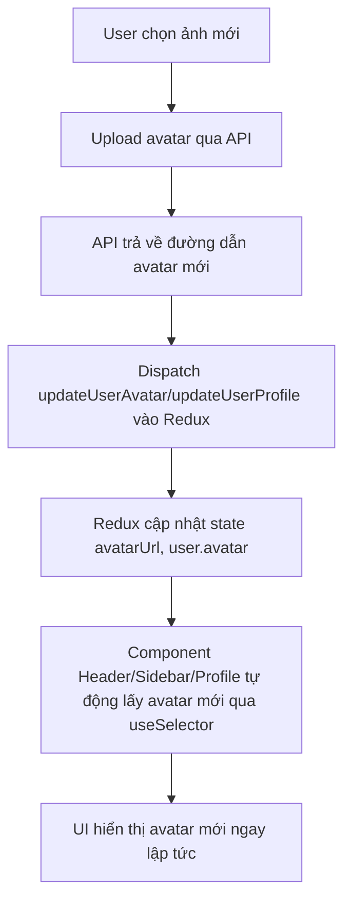

# Avatar Sync Flow (Luồng cập nhật avatar toàn hệ thống)

## 1. Tổng quan

Hệ thống sử dụng **Redux** để quản lý trạng thái avatar (AVT) và thông tin người dùng. Khi avatar được cập nhật ở bất kỳ đâu (Profile, Modal, v.v.), mọi component liên quan (Header, Sidebar, Profile, v.v.) sẽ tự động cập nhật ngay lập tức nhờ lấy dữ liệu từ Redux store.

**Không sử dụng polling, sessionStorage, hay custom event để đồng bộ avatar.**

---

## 2. Luồng cập nhật avatar chi tiết

### Bước 1: Người dùng upload avatar mới

- Thường thực hiện tại `ProfileContent.js` qua component `AvatarUpload`.
- Khi upload thành công, thunk `uploadUserAvatar` (trong `redux/thunks/userThunks.js`) sẽ dispatch action cập nhật avatar vào Redux.

### Bước 2: Cập nhật Redux store

- Action `updateUserAvatar` hoặc `updateUserProfile` (trong `redux/slices/authSlice.js`) sẽ cập nhật trường `avatarUrl` và `user.avatar` trong Redux.
- Đồng thời cập nhật avatar trong localStorage (`userProfile`).

### Bước 3: Các component tự động nhận avatar mới

- Các component như `Header.js`, `DynamicSideBar.js`, `ProfileContent.js` đều sử dụng `useSelector((state) => state.auth.avatarUrl)` để lấy avatar.
- Khi Redux store thay đổi, các component này sẽ tự động re-render và hiển thị avatar mới.

---

## 3. Các file chính liên quan

- `src/redux/slices/authSlice.js`: Quản lý state user, avatar, action cập nhật avatar.
- `src/redux/thunks/userThunks.js`: Thunk upload avatar, dispatch cập nhật Redux.
- `src/components/common/Header.js`: Hiển thị avatar, lấy avatar từ Redux.
- `src/components/siderBar/DynamicSideBar.js`: Hiển thị avatar, lấy avatar từ Redux.
- `src/components/siderBar/ProfileContent.js`: Giao diện upload avatar, gọi thunk upload avatar.
- `src/components/common/AvatarUpload.js`: Component upload ảnh đại diện.

---

## 4. Best Practice & Lưu ý

- **Chỉ lấy avatar từ Redux**: Không lấy từ localStorage/sessionStorage trực tiếp trong component UI.
- **Sau khi upload avatar thành công, chỉ cần dispatch updateUserAvatar/updateUserProfile vào Redux**.
- **Không dùng polling, không dùng custom event để đồng bộ avatar**.
- **Redux là nguồn dữ liệu duy nhất cho avatar và user info trên toàn UI**.
- **Sau khi login, phải dispatch loginSuccess(profileData.data) để đồng bộ avatar/user vào Redux**.
- **Sau khi logout, phải dispatch logout để xóa avatar/user khỏi Redux và UI cập nhật ngay**.

---

## 5. Sơ đồ luồng cập nhật avatar



---

## 6. Troubleshooting

- Nếu avatar không cập nhật ngay: Kiểm tra component đã dùng useSelector lấy avatar từ Redux chưa.
- Nếu sau login/logout avatar không đổi: Đảm bảo đã dispatch loginSuccess/logout vào Redux.
- Nếu avatar chỉ đổi sau reload: Có thể component lấy avatar từ localStorage/sessionStorage thay vì Redux.

---

## 7. Giải thích chi tiết cho bảo vệ đồ án

### Vì sao phải đồng bộ avatar qua Redux?

- Avatar xuất hiện ở nhiều nơi (Header, Sidebar, Profile, ...). Nếu chỉ cập nhật ở một chỗ, các chỗ khác sẽ không tự động biết để cập nhật lại giao diện.
- Redux là nơi lưu trữ trạng thái toàn cục (global state) của ứng dụng. Khi avatar thay đổi trong Redux, mọi component lấy avatar từ Redux sẽ tự động cập nhật lại giao diện, không cần reload, không cần hack.

### Luồng cập nhật avatar chi tiết

1. Người dùng chọn và upload avatar mới ở Profile.
2. Ảnh được gửi lên server, server trả về đường dẫn avatar mới.
3. Frontend dispatch action cập nhật avatar vào Redux (updateUserAvatar/updateUserProfile).
4. Redux cập nhật state avatarUrl, user.avatar.
5. Các component lấy avatar từ Redux sẽ tự động re-render, hiển thị avatar mới ngay lập tức.

### Nếu cô hỏi: “Tại sao không dùng localStorage/sessionStorage hoặc polling?”

- Nếu chỉ dùng localStorage/sessionStorage, các component sẽ không tự động biết khi avatar thay đổi, phải reload trang mới thấy.
- Polling (kiểm tra liên tục) hoặc custom event là giải pháp chữa cháy, không tối ưu, dễ lỗi, khó bảo trì.
- Redux giúp mọi component luôn đồng bộ, chỉ cần dispatch action là UI cập nhật tức thì, code rõ ràng, dễ bảo trì.

### Nếu cô hỏi: “Nếu upload avatar xong mà Header không đổi thì sao?”

- Lý do thường là component Header chưa lấy avatar từ Redux, hoặc chưa dispatch action cập nhật avatar vào Redux.
- Chỉ cần sửa lại để Header dùng useSelector lấy avatar từ Redux và đảm bảo dispatch đúng action, mọi thứ sẽ đồng bộ.

### Tóm tắt trả lời ngắn gọn khi bảo vệ

> “Hệ thống em dùng Redux để quản lý avatar. Khi người dùng đổi avatar, em dispatch action cập nhật avatar vào Redux. Tất cả các component như Header, Sidebar, Profile đều lấy avatar từ Redux nên sẽ tự động cập nhật ngay lập tức, không cần reload trang. Đây là cách đồng bộ trạng thái toàn cục tốt nhất trong React.”

---

## 8. Tóm tắt

- **Redux là trung tâm đồng bộ avatar.**
- **Chỉ cần dispatch đúng action, mọi UI sẽ tự động cập nhật.**
- **Không cần bất kỳ polling, event, hay hack nào khác.**

---

## 9. Ví dụ thực tế (Code mẫu từng bước)

### **Bước 1: Upload avatar và dispatch Redux**

```js
// src/components/siderBar/ProfileContent.js
import { useDispatch } from 'react-redux';
import { updateUserProfile } from '@/redux/slices/authSlice';

const dispatch = useDispatch();

const handleAvatarUploadSuccess = (avatarPath) => {
  // Khi upload thành công, cập nhật avatar vào Redux
  dispatch(updateUserProfile({ avatar: avatarPath }));
};
```

**Giải thích:** Khi người dùng upload avatar thành công, chỉ cần dispatch action cập nhật avatar vào Redux. Không cần setState cục bộ hay reload trang.

---

### **Bước 2: Redux cập nhật state avatar**

```js
// src/redux/slices/authSlice.js
const authSlice = createSlice({
  // ...
  reducers: {
    updateUserProfile: (state, action) => {
      state.user = { ...state.user, ...action.payload };
      state.avatarUrl = action.payload.avatar || state.avatarUrl;
      // Cập nhật localStorage nếu cần
    },
    // ...
  },
});
```

**Giải thích:** Khi nhận action, Redux sẽ cập nhật avatar mới vào state. Tất cả component lấy avatar từ Redux sẽ tự động nhận giá trị mới.

---

### **Bước 3: Component lấy avatar từ Redux**

```js
// src/components/common/Header.js
import { useSelector } from 'react-redux';

const avatarUrl = useSelector((state) => state.auth.avatarUrl);

return (
  <Avatar
    src={
      avatarUrl
        ? imageUrl.getFullImageUrl(avatarUrl)
        : '/img/avatar/default.jpg'
    }
  />
);
```

**Giải thích:** Component Header (và các component khác) chỉ cần lấy avatar từ Redux. Khi avatar đổi, UI sẽ tự động cập nhật.

---

### **Bước 4: Đảm bảo đồng bộ sau login/logout**

```js
// src/pages/LoginPage.js
import { useDispatch } from 'react-redux';
import { loginSuccess } from '@/redux/slices/authSlice';

// Sau khi lấy được profileData từ API:
dispatch(loginSuccess(profileData.data));

// src/components/common/Header.js
import { useDispatch } from 'react-redux';
import { logout } from '@/redux/slices/authSlice';

dispatch(logout()); // Khi logout, UI sẽ tự động xóa avatar
```

**Giải thích:** Sau khi login hoặc logout, phải dispatch action vào Redux để toàn bộ UI đồng bộ trạng thái avatar và user.

---

**Tóm lại:**

- Chỉ cần dispatch đúng action vào Redux, mọi component sẽ tự động cập nhật avatar mới.
- Không cần reload, không cần hack, không cần polling.
- Đây là cách làm hiện đại, tối ưu và dễ bảo trì nhất với React + Redux.
