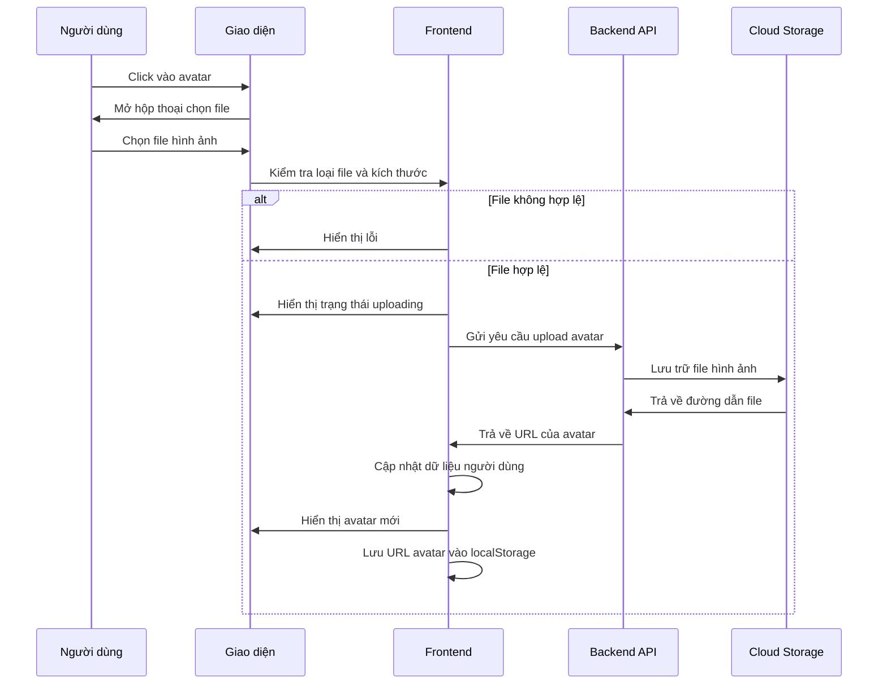

# Chức năng Cập nhật Avatar

## Tổng quan

Chức năng cập nhật avatar cho phép người dùng thay đổi ảnh đại diện của họ bằng cách nhấp vào avatar hiện tại hoặc biểu tượng camera nhỏ hiển thị trên góc avatar. Chức năng này tạo ra một trải nghiệm người dùng trực quan và tiện lợi khi muốn thay đổi ảnh đại diện.

## Cách sử dụng

1. Truy cập vào trang hồ sơ cá nhân
2. Nhấp vào ảnh avatar hiện tại hoặc biểu tượng camera ở góc trên bên phải của avatar
3. Chọn một file hình ảnh từ thiết bị của bạn (hỗ trợ các định dạng phổ biến như JPG, PNG, GIF)
4. Hệ thống sẽ tự động tải lên và cập nhật avatar mới

## Giới hạn và Xác thực

- **Loại file**: Chỉ chấp nhận các file hình ảnh (có MIME type bắt đầu bằng "image/")
- **Kích thước file**: Giới hạn tối đa 5MB
- **Thông báo lỗi**: Hiển thị thông báo lỗi rõ ràng nếu file không hợp lệ

## Quy trình xử lý



## Triển khai kỹ thuật

### 1. Frontend Component

File `ProfileContent.js` chứa các thành phần UI và logic xử lý avatar:

- **Thành phần Avatar**: Sử dụng component `Avatar` từ Material-UI
- **Input ẩn**: Sử dụng `<input type="file">` ẩn để mở hộp thoại chọn file
- **Nút camera**: Biểu tượng camera nhỏ ở góc avatar để gợi ý tính năng upload
- **Trạng thái loading**: Hiển thị CircularProgress khi đang tải lên

### 2. Xử lý Frontend

Có hai cách để xử lý việc tải lên avatar: tích hợp vào giao diện hồ sơ hoặc tạo một component riêng.

#### Cách 1: Tích hợp vào trang hồ sơ

```javascript
// Kích hoạt input file khi nhấp vào avatar
const handleAvatarClick = () => {
  fileInputRef.current?.click();
};

// Xử lý khi người dùng chọn file
const handleFileChange = async (event) => {
  const file = event.target.files[0];
  if (!file) return;

  // Kiểm tra loại file và kích thước
  if (!file.type.startsWith("image/")) {
    notify.error("Lỗi upload", "Vui lòng chọn một file hình ảnh");
    return;
  }

  // Giới hạn kích thước 5MB
  if (file.size > 5 * 1024 * 1024) {
    notify.error("Lỗi upload", "Kích thước file quá lớn");
    return;
  }

  try {
    setIsUploadingAvatar(true);
    await saveAvatarToServer(file);
  } catch (error) {
    notify.error("Lỗi upload", "Không thể tải lên avatar");
  } finally {
    setIsUploadingAvatar(false);
  }
};

// Tải avatar lên server
const saveAvatarToServer = async (file) => {
  try {
    const response = await userService.uploadAvatar(file);
    if (response.success) {
      setAvatarUrl(response.data.avatarUrl);
      notify.success("Thành công", "Cập nhật avatar thành công");
    } else {
      throw new Error(response.message);
    }
  } catch (error) {
    console.error("Lỗi khi tải avatar:", error);
    throw error;
  }
};
```

#### Cách 2: Component độc lập (theo ví dụ từ Backend)

```jsx
import React, { useState } from "react";
import axios from "axios";

function AvatarUpload() {
  const [selectedFile, setSelectedFile] = useState(null);

  const handleFileChange = (event) => {
    setSelectedFile(event.target.files[0]);
  };

  const handleUpload = async () => {
    if (!selectedFile) {
      alert("Vui lòng chọn một file ảnh");
      return;
    }

    // Tạo form data
    const formData = new FormData();
    formData.append("file", selectedFile);

    try {
      // Gửi request
      const response = await axios.post("/api/users/profile/avatar", formData, {
        headers: {
          "Content-Type": "multipart/form-data",
          Authorization: "Bearer " + localStorage.getItem("token"),
        },
      });

      if (response.data.success) {
        alert("Cập nhật avatar thành công!");
        // Cập nhật avatar trên UI
        // Ví dụ: setUserAvatar(response.data.data.avatarUrl);
      } else {
        alert("Lỗi: " + response.data.message);
      }
    } catch (error) {
      console.error("Lỗi khi tải avatar:", error);
      alert("Không thể tải avatar lên");
    }
  };

  return (
    <div>
      <input type="file" onChange={handleFileChange} accept="image/*" />
      <button onClick={handleUpload} disabled={!selectedFile}>
        Tải Avatar
      </button>
    </div>
  );
}

export default AvatarUpload;
```

### 3. API Service

File `userService.js` chứa hàm `uploadAvatar` để giao tiếp với backend:

```javascript
/**
 * Upload avatar image
 * @param {File} file - Image file to upload
 * @returns {Promise<Object>} API response with uploaded image URL
 */
uploadAvatar: async (file) => {
  try {
    // Tạo FormData để gửi file
    const formData = new FormData();
    formData.append("file", file); // Chú ý: Backend yêu cầu key là 'file' không phải 'avatar'

    // Lấy token từ localStorage
    const token = localStorageUtil.get("token");

    // Gửi request với header multipart/form-data và token xác thực
    const response = await axios.post("/api/users/profile/avatar", formData, {
      headers: {
        "Content-Type": "multipart/form-data",
        Authorization: `Bearer ${token}`,
      },
    });

    // Kiểm tra response từ server
    if (response.data.success) {
      return {
        success: true,
        data: response.data.data, // Giả định server trả về đường dẫn avatar trong data
        message: "Cập nhật avatar thành công",
      };
    } else {
      return {
        success: false,
        message: response.data.message || "Không thể cập nhật avatar",
      };
    }
  } catch (error) {
    console.error("❌ Error uploading avatar:", error);
    return {
      success: false,
      message: error.response?.data?.message || "Không thể cập nhật avatar",
      error: error,
    };
  }
};
```

### 4. Quản lý State

- **avatarUrl**: Lưu trữ URL hiện tại của avatar
- **isUploadingAvatar**: Theo dõi trạng thái đang tải lên
- **fileInputRef**: Tham chiếu đến input file ẩn

### 5. Lưu trữ Cục bộ

Sau khi cập nhật avatar thành công, URL avatar mới được lưu vào localStorage để duy trì trạng thái giữa các phiên làm việc:

```javascript
// Lưu vào localStorage
localStorageUtil.set("userProfile", updatedUser);
```

## Yêu cầu Backend API

Theo yêu cầu từ Backend, API cần được gọi với cấu trúc như sau:

Backend hỗ trợ endpoint `/api/users/profile/avatar` để xử lý upload avatar:

- **Method**: POST
- **Content-Type**: multipart/form-data
- **Authorization**: Bearer token
- **Body**: FormData với key "file" chứa file hình ảnh
- **Response**: Object bao gồm:
  ```json
  {
    "success": true,
    "data": {
      "avatarUrl": "https://example.com/path/to/avatar.jpg"
    },
    "message": "Cập nhật avatar thành công"
  }
  ```

## Đảm bảo Bảo mật

1. **Xác thực**: API yêu cầu token xác thực từ người dùng đã đăng nhập
2. **Xác thực loại file**: Kiểm tra trên cả frontend và backend
3. **Giới hạn kích thước**: Giới hạn kích thước file để ngăn chặn tấn công DoS

## Mở rộng trong tương lai

1. **Chỉnh sửa ảnh**: Tích hợp công cụ cắt/chỉnh sửa ảnh trước khi tải lên
2. **Tùy chọn avatar**: Cung cấp thư viện avatar có sẵn để người dùng lựa chọn
3. **Xóa avatar**: Thêm tùy chọn quay lại avatar mặc định

## Cách triển khai mới (dựa trên yêu cầu của Backend)

Dựa trên ví dụ từ Backend, tôi đã tạo một component `AvatarUpload.js` có thể tái sử dụng trong thư mục `src/components/common/`. Component này có thể được sử dụng độc lập hoặc tích hợp vào trang hồ sơ.

### Sử dụng component AvatarUpload

```jsx
import React, { useState } from "react";
import AvatarUpload from "@/components/common/AvatarUpload";
import { Avatar, Box, Typography } from "@mui/material";

function ProfilePage() {
  const [avatarUrl, setAvatarUrl] = useState(
    "https://example.com/default-avatar.jpg"
  );

  // Callback khi upload thành công
  const handleUploadSuccess = (newAvatarUrl) => {
    setAvatarUrl(newAvatarUrl);
    // Lưu vào localStorage hoặc cập nhật state ứng dụng
  };

  return (
    <Box>
      <Typography variant="h5">Hồ sơ cá nhân</Typography>

      <Box
        sx={{
          display: "flex",
          flexDirection: "column",
          alignItems: "center",
          my: 3,
        }}
      >
        <Avatar src={avatarUrl} sx={{ width: 100, height: 100, mb: 2 }} />

        <Typography variant="body1" gutterBottom>
          Cập nhật avatar của bạn
        </Typography>

        <AvatarUpload
          onUploadSuccess={handleUploadSuccess}
          onUploadError={(errorMsg) => console.error(errorMsg)}
        />
      </Box>

      {/* Phần còn lại của trang hồ sơ */}
    </Box>
  );
}
```

### Tích hợp vào ProfileContent.js

Để tích hợp component này vào ProfileContent.js hiện có, bạn có thể:

1. Import component AvatarUpload
2. Tạo một modal hoặc drawer để hiển thị component này khi người dùng click vào avatar
3. Hoặc thay thế hoàn toàn phần xử lý avatar hiện có với component mới

```jsx
import AvatarUpload from "@/components/common/AvatarUpload";
import { Dialog, DialogTitle, DialogContent } from "@mui/material";

// Thêm state trong component ProfileContent
const [isAvatarDialogOpen, setIsAvatarDialogOpen] = useState(false);

// Thêm hàm xử lý mở dialog
const handleOpenAvatarDialog = () => {
  setIsAvatarDialogOpen(true);
};

// Thêm hàm xử lý khi upload thành công
const handleAvatarUploadSuccess = (newAvatarUrl) => {
  setAvatarUrl(newAvatarUrl);
  setIsAvatarDialogOpen(false);

  // Cập nhật userData và localStorage
  const updatedUser = {
    ...userData,
    avatarUrl: newAvatarUrl,
  };
  setUserData(updatedUser);
  localStorageUtil.set("userProfile", updatedUser);
};

// Thêm dialogue vào phần render
<Dialog open={isAvatarDialogOpen} onClose={() => setIsAvatarDialogOpen(false)}>
  <DialogTitle>Cập nhật Avatar</DialogTitle>
  <DialogContent>
    <AvatarUpload
      onUploadSuccess={handleAvatarUploadSuccess}
      onUploadError={() => setIsAvatarDialogOpen(false)}
    />
  </DialogContent>
</Dialog>;

// Sửa phần xử lý click vào avatar
const handleAvatarClick = () => {
  handleOpenAvatarDialog();
};
```

### Lưu ý quan trọng

Dựa trên ví dụ từ Backend, có một số điểm cần lưu ý:

1. Key trong FormData là `file` không phải `avatar`
2. Endpoint API là `/api/users/profile/avatar`
3. Cần gửi kèm token xác thực dưới dạng `Bearer token`
4. Response từ API sẽ có dạng `{ success: true, data: { avatarUrl: "..." }, message: "..." }`

---

_Lưu ý: Tài liệu này mô tả tính năng cập nhật avatar trong hệ thống Gender Healthcare Service Management System. Vui lòng tham khảo mã nguồn để biết chi tiết triển khai cụ thể._
